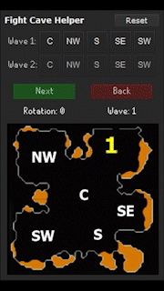
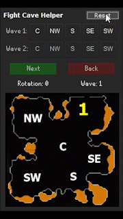

# Fight Cave Helper

---
This plugin is a simple tool you can use to help predict and display images for each wave spawn in the Fight Cave

Once installed/enabled, a fire cape logo 	 will be added to the side panel of the client. Click it to open the plugin panel.

## How to Use

---
Select the wave spawn buttons for where the monsters spawn in waves 1 and 2. 

Once the rotation is determined just click the Next Button to move to the next wave. The Back Button is there if you need to go back a wave.

To start over from wave 1, hit the Reset Button at the top.

***NOTE:*** Rotations 7 and 8 have an extra step, where you need to select the spawn buttons for wave 4 monsters:

If you click an invalid spawn combination for wave 2 (or wave 4), the helper will be reset to wave 1.